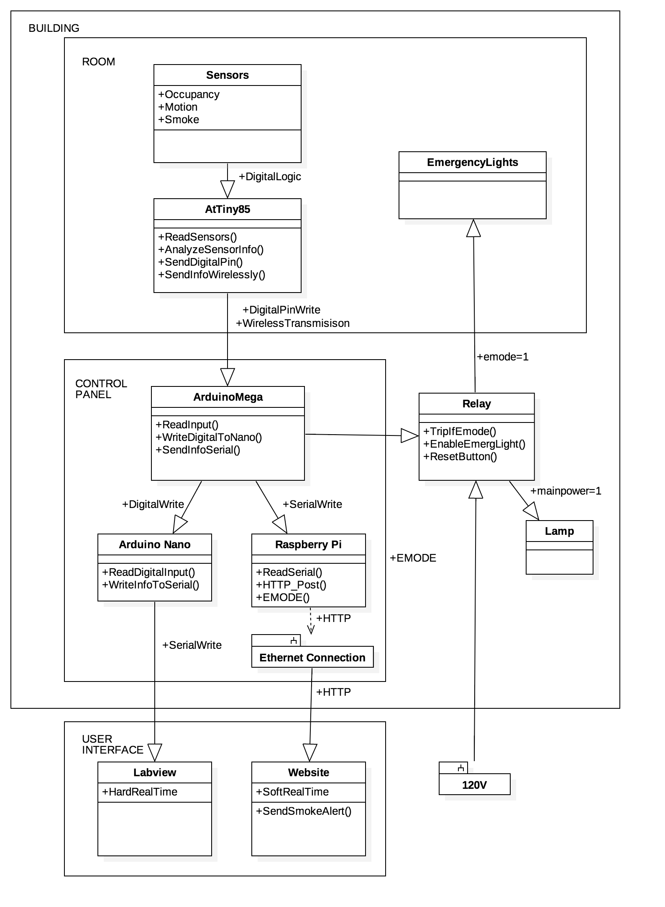

# Building Management System

The website and arduino files were made for a senior design project at Florida Atlantic University. The project aimed to create a IoT Building Management System (BMS) that collected information from each room without invasion of privacy. Thus the sensors to collect data for each room: Occupancy via two lasers and a photodiode (could be upgraded to IR Laser), Motion via a PIR sensor, and Smoke via a smoke sensor. This information was uploaded to the server and was available for soft-real time displaying. 

The sensors logic was determined by an ATTiny85, in which multiple ATTiny85's were connected via GPIO to a single Arduino Mega, where parsing the gathered information took place. An Arduino Nano was connected via GPIO to the Arduino Mega and displayed information real-time on Lab-View. The Arduino Mega was connected via USB to a Raspberry Pi which read the information through serial and uploaded information to the website. When smoke was detected, the RaspberryPi uploads the last information before notifying a relay-controller to switch from main-power to "E-Mode", where the devices run on battery power. A button can be pressed to switch main power back on once the smoke has cleared.




## Hardware/Software

*Hardware Used*
```
Arduino Mega x1
Arduino Nano x1
ATTiny85 x3 / room
RaspberyPi 3
```

*Software Used*
```
Arduino IDE
LabView
MAMP
```

## Built With

* [Bootstrap 3] (http://getbootstrap.com/docs/3.3/) - Front-End Framework

## Authors

* **Grant Lanham** - *Website, Arduino* - [7grant2](https://github.com/7grant2/)
* **Darlon Lawrence** - *Soldering, Circuit Building, LabView*

## License

This project is licensed under the MIT License - see the [LICENSE.md](LICENSE.md) file for details

## Acknowledgments

* Thanks to FAU for supplying initial hardware necessary to build the project.


